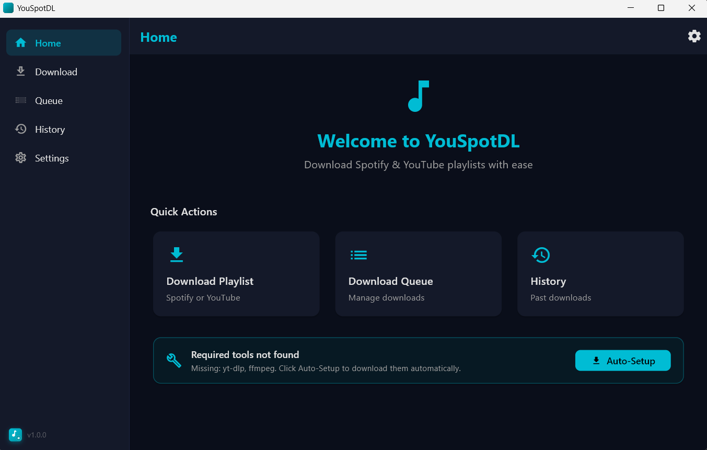
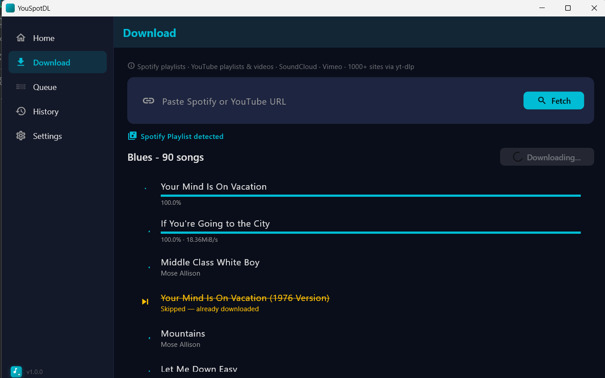
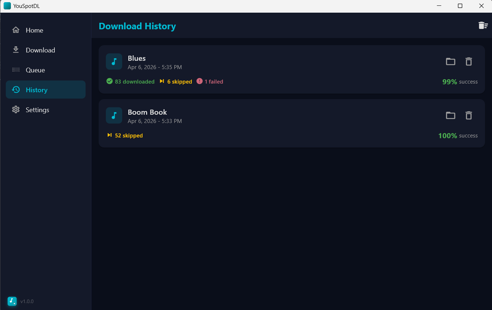
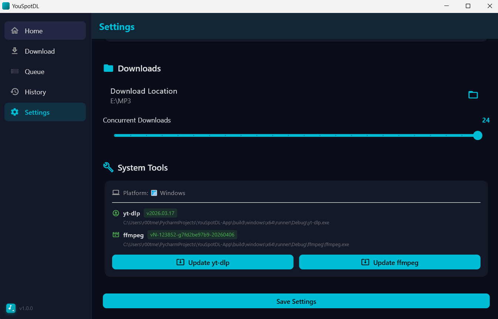

# YouSpotDL - App

> **Desktop GUI for downloading Spotify playlists, YouTube playlists, and content from 1000+ sites.**  
> Built with Flutter · powered by [yt-dlp](https://github.com/yt-dlp/yt-dlp) and [ffmpeg](https://ffmpeg.org/).

---

## Screenshots

### Home

[](docs/main.png)

### Download

[](docs/download.png)

### History

[](docs/history.png)

### System Tools

[](docs/settings-system.png)

---

## Features

| | |
|---|---|
| 🎵 **Spotify playlists** | Public playlists download without any API credentials. Private playlists require optional OAuth. |
| 📺 **YouTube playlists & videos** | Paste a playlist or single-video URL — pick resolution and format. |
| 🌐 **1000+ sites** | SoundCloud, Vimeo, TikTok, Twitch, Dailymotion, Twitter/X, and more via yt-dlp. |
| ⚡ **Concurrent downloads** | Up to 8 parallel songs with live per-song progress bars. |
| ⏭️ **Skip existing files** | Word-overlap matching detects already-downloaded files — no duplicates, no errors. |
| 📋 **History** | Every session is saved — shows downloaded / skipped / error counts with colour coding. |
| 🎛️ **Format selection** | MP3 (best / 192 kbps), MP4 1080p / 720p / 480p, or best available. |
| 🔧 **System Tools panel** | Live yt-dlp and ffmpeg version detection with per-platform install hints. |

---

## Requirements

### Runtime tools

| Tool | Windows | macOS | Linux |
|---|---|---|---|
| **yt-dlp** | Place `dlp.exe` or `yt-dlp.exe` next to the app **or** `pip install yt-dlp` | `brew install yt-dlp` | `pip install yt-dlp` |
| **ffmpeg** | Extract `ffmpeg.zip` next to the app **or** install and add to PATH | `brew install ffmpeg` | `sudo apt install ffmpeg` |

> **Without ffmpeg** — songs download as `.webm`/`.opus` instead of MP3, and HD videos cannot be merged.  
> The app shows a clear warning in **Settings → System Tools** if either tool is missing.

### Flutter SDK

- Flutter ≥ 3.11 / Dart ≥ 3.11  
- Windows 10+, macOS 12+, or Linux (desktop target)

---

## Getting Started

### 1 — Clone & install dependencies

```bash
git clone https://github.com/r00tmebaby/YouSpotDL-App
cd YouSpotDL-App
flutter pub get
```

### 2 — Place yt-dlp and ffmpeg (Windows)

```
YouSpotDL-App/
  dlp.exe          ← rename yt-dlp.exe to dlp.exe  (download from github.com/yt-dlp/yt-dlp)
  ffmpeg.exe       ← or keep as ffmpeg/ folder with ffmpeg.exe inside
```

On macOS / Linux just `brew install yt-dlp ffmpeg` or `pip install yt-dlp && sudo apt install ffmpeg`.

### 3 — Run

```bash
flutter run -d windows   # or: -d macos  /  -d linux
```

### 4 — Build a release executable

```bash
flutter build windows --release
# Output: build/windows/x64/runner/Release/YouSpotDL.exe
```

---

## Spotify Private Playlists (optional)

Public Spotify playlists work out-of-the-box — **no credentials needed**.

To access **private or collaborative** playlists:

1. Go to [Spotify Developer Dashboard](https://developer.spotify.com/dashboard) and create an app.
2. Add `http://127.0.0.1:8888/callback` as a Redirect URI.
3. Open **Settings → Spotify API Credentials**, enter your Client ID and Secret, and click **Connect**.

---

## Architecture

```
lib/
  core/           # theme, router, URL detector, constants
  models/         # Freezed data classes (DownloadTask, Song, Settings, …)
  pages/          # Home, Download, Queue, History, Settings
  providers/      # Riverpod state (download, auth, settings, history, tools)
  services/       # DownloadService (yt-dlp wrapper), SpotifyApiService, AuthService
  widgets/        # AppShell (sidebar), AppLogo, SongListTile, VideoInfoCard
```

**Key dependencies**

| Package | Purpose |
|---|---|
| `flutter_riverpod` | State management |
| `freezed` | Immutable data models |
| `go_router` | Declarative navigation |
| `window_manager` | Desktop window sizing |
| `file_picker` | Output folder selection |
| `http` | Spotify API calls |
| `flutter_secure_storage` | Spotify token storage |

---

## How It Works

1. **Paste a URL** — the app auto-detects Spotify playlist, YouTube playlist, YouTube video, or any yt-dlp-supported URL.
2. **Fetch metadata** — track titles are fetched (Spotify via yt-dlp or API; YouTube via `--flat-playlist`).
3. **Start download** — each song runs `yt-dlp -x --audio-format mp3` with `--concurrent-fragments 8` for speed. YouTube video URLs are downloaded directly; Spotify tracks are searched on YouTube via `ytsearch:`.
4. **Progress** — stdout is streamed and parsed in real time; per-song percent / speed / ETA shown.
5. **Post-processing** — ffmpeg converts to MP3 or merges video+audio streams.
6. **History** — results saved to `.youspotdl_history.json` next to the executable.

---

## Troubleshooting

| Problem | Fix |
|---|---|
| Progress stuck at 0% | `yt-dlp` not found — check **Settings → System Tools** |
| Songs download as `.webm` | `ffmpeg` not found — see install instructions above |
| Spotify playlist shows 0 songs | Playlist may be private — connect your Spotify account in Settings |
| HD video download fails | ffmpeg required for merging separate video+audio streams |
| App reports "already downloaded" wrongly | Delete the file or move it out of the output folder |

---
